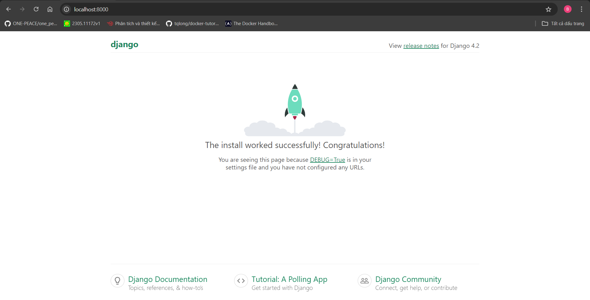

# Bản hướng dẫn cho anh em trong nhóm
### Một số lưu ý trước khi chạy project
- Nếu chưa tải docker thì có thể tải [tại đây](https://www.docker.com/products/docker-desktop/) và xem hướng dẫn cài đặt [tại đây](https://docs.docker.com/desktop/install/mac-install/).
- Nếu chưa có conda thì có thể tải [tại đây](https://docs.anaconda.com/miniconda/).

### Hướng dẫn chạy project
1. Mở `cmd`.
2. Khởi tạo một môi trường ảo conda hoặc bất cứ công cụ nào khác.
```bash
conda create -n <your_conda_env_name> python=3.9 pip -y
```
3. Clone repo project về máy.
```bash
git clone https://github.com/sambt22022517/Unlimited-Film-Outlet.git
```
4. Chuyển hướng đến thự mục `Unlimited-Film-Outlet`.
5. - Đối với thành viên nhóm, tải file `.env` đã được gửi trong nhóm chat về máy và để vào thư mục hiện tại.
   - Đối với người khác, có thể xem file `.envexample` để biết về cấu trúc của một file `.env`, từ đó tự tạo ra file riêng.
6. Chạy lệnh `docker compose build`.
7. Để xem thử project, chạy lệnh `docker compose up` và truy cập vào link [localhost:8000](http://localhost:8000/).


### Một số hướng dẫn cho thành viên trong quá trình thực hiện project
#### 1. __TUYỆT ĐỐI__ không được tự thêm thư viện vào `requirements.txt` bằng tay.
   Thay vào đó hãy dùng lệnh `pip install <module_name>` ở môi trường ảo conda rồi `pip freeze > requirements.txt`.
   Làm thế này, container docker có thể sẽ nặng.
   Nhưng sẽ tránh được việc `pip` tự động tải phiên bản mới nhất của thư viện về, loại bỏ khả năng trong tương lai không thể chạy được project.
#### 2. Về việc thay đổi code trong quá trình thực hiện
- Đối với những file không phải `models.py`: Bất kể việc thêm, sửa, xoá đều chỉ cần lưu lại là project sẽ tự động được cập nhật.
- Đối với file `models.py`: Khi trong một class có thêm hoặc xoá bớt một trường nào đó, bắt buộc phải chạy lệnh `docker compose run web python manage.py makemigrations` và `docker compose run web python manage.py migrate`.
  Nếu đang chạy project thì có thể nhấn `Ctrl + C` để dừng project trước rồi chạy lệnh, hoặc mở một tab `cmd` mới rồi chạy lệnh mà không cần dừng project.